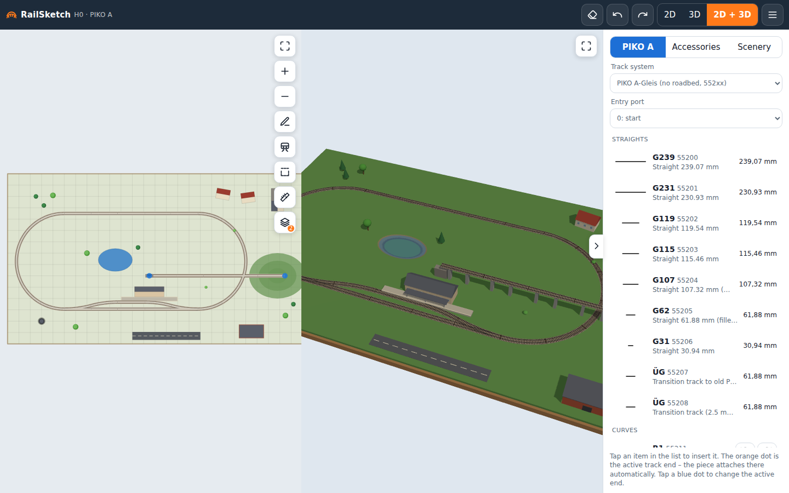
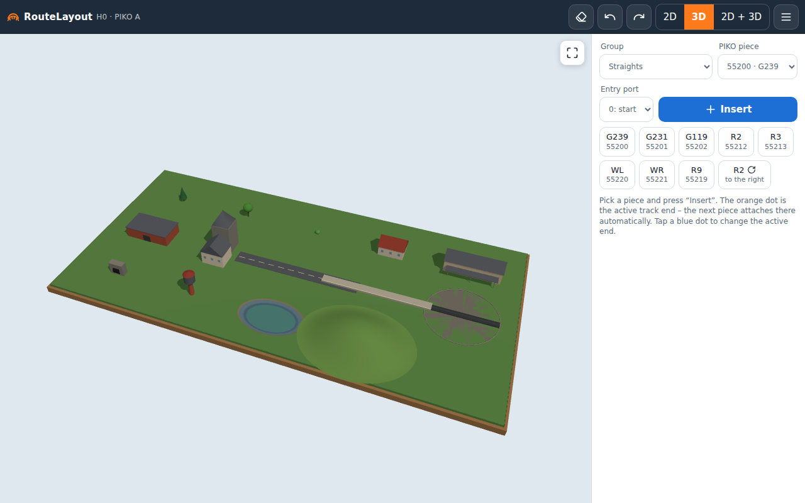

# RouteLayout — H0 track planner for PIKO A-Gleis with 3D preview

**Live app: https://budnix.github.io/RouteLayout/**

A web app (HTML5, ES modules, Canvas 2D + three.js) for designing H0 model railway layouts with a real-time 3D preview. Runs in Safari on iPad and iPhone (touch, pinch-zoom, "Add to Home Screen") as well as on desktop browsers. No build step, no backend, no account — your layout is saved in the browser.





## Features

- Complete **PIKO A-Gleis H0** catalog (552xx series) with exact geometry: straights, curves R1–R4 / R9, 7.5° curves, standard, curved, three-way and Y turnouts, double slip, crossings, flex track, buffer stop
- **Auto-drawing**: pick a piece, tap *Insert* — it snaps onto the active open track end at the correct angle. Tap any open end (e.g. a turnout branch) to continue from there
- **Sketch mode**: draw the track path freehand with a finger or mouse, press *Finish drawing* and the app fits real PIKO pieces to it — straights, curves and turnouts where a second stroke branches off. Optional guide grid with configurable spacing
- **Test run**: a train (loco + two wagons) drives along the track in 2D and 3D; tap a turnout to throw it, set the speed, reverse; it stops at dead ends — the quickest way to check that a layout actually works
- **Feasibility check**: grades over 3.5 %, tracks crossing without a crossing piece, insufficient clearance under a bridge (< 55 mm), track centres too close (< 45 mm), track off the baseboard — markers on the plan, a list in the menu, a counter on the menu button
- **Loop closing**: with the active end selected, the link button finds the 1–4 catalog pieces that close the gap to the facing open end exactly (or tells you how many millimetres are missing); a sketched oval is closed automatically
- Drag pieces with a finger or mouse; nearby track ends snap together
- **3D preview** with rails (16.5 mm gauge), sleepers, ballast, baseboard and shadows — rendered on demand to save battery
- **Turntable** as a track element: tap anywhere on the rim to create a connection there (1° steps), drag a track onto the rim and it snaps radially, rotate the bridge, set the diameter
- **Heights**: every piece has a start height and a grade; set *height* to lift a whole connected group, *grade %* to build a ramp (pieces downstream rise with it). Ends only connect at matching heights — a helix shows its gap honestly. In 3D the track follows the profile with piers under viaducts; a track through a hill becomes a tunnel
- **Scenery**: trees, houses, station, warehouse, church, roads, platforms, turntable, tunnel portal, water tower, pond, hill — flat icons in 2D, simple procedural solids in 3D (no external models); move, rotate and resize them
- **Group selection** with a rectangle: move, rotate and delete many pieces at once; **dimension mode** shows lengths, radii and the spacing between parallel tracks; a **Recently used** section sits at the top of the palette
- **Share a layout as a link** — the whole plan is compressed into the URL, no server involved
- **Print 1:1** on A4 tiles (lay the sheets on the baseboard and mark the track) or the whole plan on one page — from the browser's print dialog, so "Save as PDF" works on iPad too
- **Shopping list**: enter how many of each article you already own; the bill of materials shows what is left to buy and copies the list to the clipboard
- Undo/redo, autosave, JSON import/export, PNG export, bill of materials with article numbers
- Interface in **English, German and Polish** (auto-detected, switchable in the menu)
- Configurable baseboard size, dark mode, installable PWA that **works offline** (service worker caches the app; each deploy ships a new version)

## Running locally

It's a static site. Any HTTP server will do (ES modules don't load from `file://`):

```sh
npx serve .           # or: python3 -m http.server 8080
```

Then open `http://localhost:8080`.

## How to draw

1. The palette has three tabs — **PIKO A**, **Accessories**, **Scenery** — each a list of rows with a shape thumbnail, code, article number, description and the key dimensions. Tap a row to insert it; curves have *left* / *right* buttons.
2. The orange dot with an arrow is the **active track end**. The next inserted piece attaches there with the right angle.
3. Tap any blue dot (open end) to move the active end there — e.g. onto a turnout's branch.
4. **Entry port** selects which end of the new piece connects to the active end (e.g. a turnout via port 2 is entered from its branch).
5. Drag pieces to move them; ends close to each other snap. Rotate with ⟲ ⟳ or the `R` key.
6. Switch **2D / 3D / 2D+3D** in the top bar. In 3D: one finger orbits, two fingers zoom and pan.
7. **Sketch mode** (✎): draw strokes where the track should go; start a new stroke on an existing one for a branch; a stroke starting at an open track end continues from it. *Finish drawing* fits pieces; *Undo* reverts the whole fit in one step. The guide grid checkbox and its spacing (menu) help keep strokes straight and parallel. *Normalise lines* (on by default) acts the moment you lift your finger: the stroke you just drew is replaced by a clean straight or an arc with a PIKO radius (a 7° bend becomes 7.5°, r ≈ 430 mm becomes R2), so what you see is what *Finish drawing* will build; switch it off to have the track follow your stroke literally. The normaliser reasons from the PIKO palette: a bend tighter than R1 that only sweeps a few degrees cannot be built, so it is read as hand jitter and straightened, while a long tight bend is read as "as tight as possible" and becomes R1; alternating wiggles that stay within a few centimetres of a straight collapse into that straight, but a genuine S-curve (two R2 arcs) is kept.
8. **Turntable** (Accessories → TT): insert it, tap its rim where a stall track should start — the orange cursor moves there — then insert pieces as usual. ⟲ ⟳ rotate the bridge; the ⌀ field sets the pit diameter.
9. **Heights**: with a track piece selected, *height* sets the start height of the piece and shifts everything connected to it; *grade %* tilts the piece and raises everything beyond its exits. Height labels appear on the 2D plan.
10. **Scenery**: pick a *Scenery: …* group, insert an object, drag it into place; the selection bar has rotate buttons and length/width fields (trees and the turntable scale uniformly).
11. Menu ☰: layout name, baseboard size and colour (picker or presets: grass, plywood, grey, white, earth), grid spacing, JSON export/import, PNG export, bill of materials.

Keyboard: `Ctrl/Cmd+Z` undo, `Ctrl/Cmd+Shift+Z` / `Ctrl+Y` redo, `Delete` remove, `R` / `Shift+R` rotate, `Enter` insert (or finish drawing), `D` toggle sketch mode, `Esc` leave sketch mode.

## Track catalog

`js/catalog.js` contains every PIKO A-Gleis H0 element (552xx series, without roadbed) with geometry from the PIKO brochure (470 mm module, 61.88 mm parallel track spacing):

| No. | Code | Description |
|---|---|---|
| 55200 | G239 | straight 239.07 mm |
| 55201 | G231 | straight 230.93 mm |
| 55202 | G119 | straight 119.54 mm |
| 55203 | G115 | straight 115.46 mm |
| 55204 | G107 | straight 107.32 mm |
| 55205 | G62 | straight 61.88 mm |
| 55206 | G31 | straight 30.94 mm |
| 55207 / 55208 | ÜG | transition tracks 62 mm |
| 55209 | G940 | flex track 940 mm |
| 55211–55214 | R1–R4 | curves 30°, r = 360 / 421.88 / 483.75 / 545.63 mm |
| 55215* / 55218 | R1 7.5° / R2 7.5° | short curves |
| 55219 | R9 | counter-curve 15°, r = 907.97 mm |
| 55220 / 55221 | WL / WR | left / right turnout 15°, R9, 239 mm |
| 55222 / 55223 | BWL / BWR | curved turnout R2/R3 |
| 55227 / 55228 | BWL-R3 / BWR-R3 | curved turnout R3/R4 |
| 55224 | DKW | double slip 15° |
| 55225 | W3 | three-way turnout |
| 55226 | WY | Y turnout |
| 55240 / 55241 | K15 / K30 | crossings 15° / 30° |
| 55280 | — | buffer stop |
| 554xx | — | the same pieces with roadbed (*PIKO A-Gleis mit Bettung*): identical geometry, article number = 552xx + 200 (55418 confirmed; verify the others before ordering) — pick the system at the top of the PIKO tab |
| TT | — | generic turntable (adjustable diameter, connections at any angle) |

`*` article number to be confirmed (geometry is correct).

Curved turnouts are modelled as two arcs sharing a start point (as in AnyRail/SCARM libraries); PIKO recommends a G62 filler after them.

Other track systems (Roco, Tillig, Märklin C, Peco…) can be added by extending `js/catalog.js` — every piece is just a list of line/arc segments plus connection ports; the palette lists whatever the catalog contains, with thumbnails generated from the geometry.

## Project structure

- `js/catalog.js` — catalog data and geometry generator (segments: line/arc, ports with heading)
- `js/layout.js` — layout model: transforms, connection detection, snapping, undo/redo, JSON, BOM
- `js/editor2d.js` — Canvas 2D editor using Pointer Events (edit and sketch modes)
- `js/normalize.js` — stroke normalisation: curvature-based segmentation into straights and arcs, circle/line fitting, snapping of radii (R1–R4, R9), arc angles and headings to the PIKO grid, DP decomposition of straights into the fewest pieces
- `js/fitter.js` — turns normalised strokes into connected pieces (turnout placement where a stroke branches off, attachment to open ends); a greedy piece-by-piece fitter is kept as a fallback for sketches the normaliser cannot follow
- `js/scenery.js` — scenery catalog with 2D drawing and 3D builders (three.js primitives)
- `js/view3d.js` — three.js preview (rails, sleepers, ballast, baseboard, scenery), on-demand rendering
- `js/i18n.js` — UI and catalog translations (EN / DE / PL)
- `js/main.js` — orchestrator: creates the app context and initialises the UI slices
- `sw.js` — service worker: the app is cached on first visit and works offline; each deploy ships a new cache version
- `js/ui/` — UI split into vertical slices (`palette`, `topbar`, `sketch`, `problems`, `tools`, `trainmode`, `closing`, `selection`, `menu`), each exporting `init(app)`
- `vendor/` — three.js (MIT) copied from npm, no CDN

## Tests and CI

```sh
npm ci
npx playwright install chromium
npm test            # smoke test in headless Chromium, screenshots in test-results/
```

- `.github/workflows/test.yml` — runs the tests on every push and pull request.
- `.github/workflows/pages.yml` — after a green `Test` run on `main`, deploys that commit to GitHub Pages (repo setting: Pages → Source → **GitHub Actions**).

## File format

```json
{ "version": 2, "name": "Layout", "board": { "w": 2000, "h": 1000, "color": "#5f8f4a" },
  "pieces":  [ { "id": "55200", "x": 300, "y": 250, "rot": 0 } ],
  "scenery": [ { "type": "house", "x": 800, "y": 400, "rot": 15, "w": 120, "h": 90 } ] }
```

Track pieces: `x, y` in mm (piece origin = port 0), `rot` in degrees, optional `z` (start height, mm) and `dz` (rise over the piece). A turntable (`id: "TT"`) has `x, y` at its centre plus `r`, `bridge` (angle) and `angles` (rim connections). Scenery: `x, y` is the object centre, `w` runs along its local X axis, `h` across. Version 1 files (without `scenery`) still load.

## For AI coding agents

`AGENTS.md` documents the architecture, coordinate conventions, the sketch-normalisation rules and the testing/CI traps. Read it before making changes.

## Contributing

Issues and pull requests are welcome — especially geometry corrections, new track systems and iOS quirks.

## License

MIT. three.js is © its authors, MIT licensed (see `vendor/THREE-LICENSE`).
